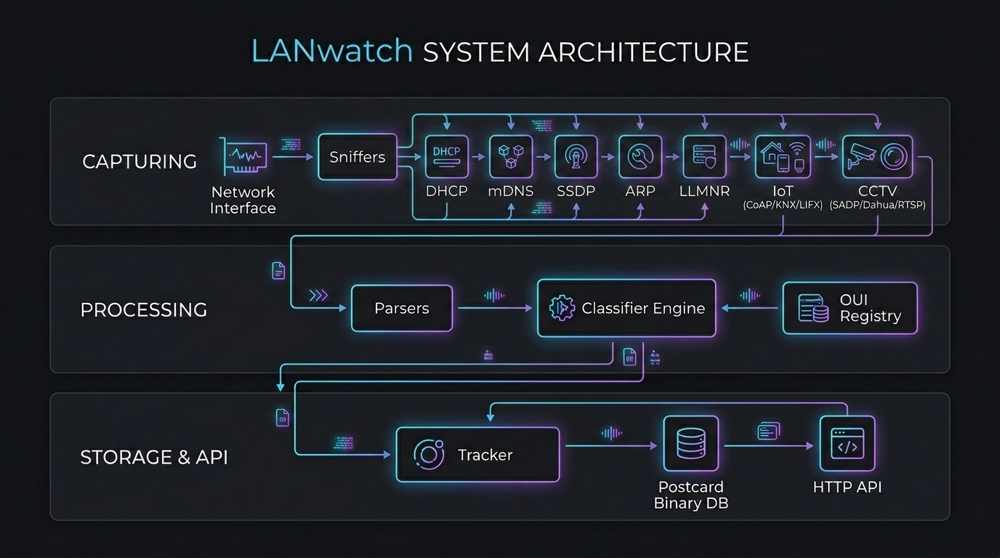
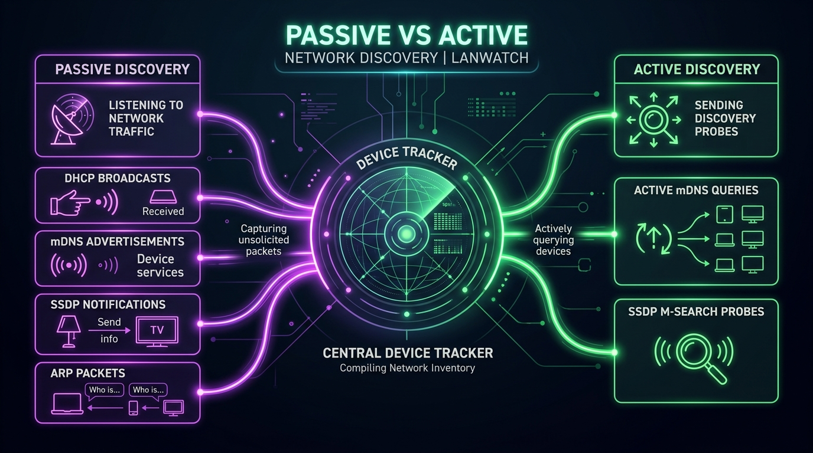
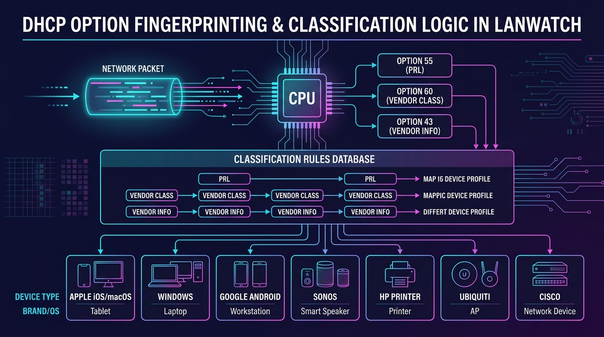

# LANwatch

A Rust library and CLI tool for network device discovery and tracking via DHCP, mDNS, SSDP/UPnP, and IEEE-OUI identification.



## Features

- **DHCPv4 Support**: Capture and parse DHCP DISCOVER, OFFER, REQUEST, ACK, NAK, RELEASE, and INFORM messages
- **DHCPv6 Support**: Capture and parse SOLICIT, ADVERTISE, REQUEST, CONFIRM, RENEW, REBIND, REPLY, RELEASE, DECLINE, RECONFIGURE, and INFO-REQUEST messages
- **mDNS Support** (optional): Passive and active mDNS discovery for enhanced device identification
- **SSDP/UPnP Support** (optional): Passive and active SSDP discovery for UPnP and media devices
- **ARP Sniffing**: Passive Layer 2 sniffing of ARP frames (Request & Reply) to dynamically discover silent network devices
- **DHCP Option 55, 60, & 43 OS/Vendor Fingerprinting**: Identifies device operating systems and brands using PRL (Parameter Request List), Vendor Class Identifiers, and Option 43 Vendor-Specific Information (e.g., Windows, macOS/iOS, Android/Linux, HP printers, Sonos, Ubiquiti/UniFi, Cisco, Yealink, Polycom, etc.)
- **LLMNR Sniffing** (optional): Passive sniffing of Link-Local Multicast Name Resolution (LLMNR) traffic to resolve and update local device hostnames
- **NetBIOS Name Service (NBNS) Sniffing** (optional): Passive sniffing of NetBIOS traffic on UDP port 137 to resolve hostnames and infer device roles (e.g., file server). Gated under `mdns` feature.
- **WS-Discovery (WSD) Sniffing** (optional): Passive sniffing of SOAP XML multicast probe traffic on UDP port 3702 to discover network hardware, PCs, and IP Cameras. Gated under `ssdp` feature.
- **mDNS TXT Record Parsing**: Extracts model, md, and ty metadata from DNS-SD records to identify specific hardware devices (Apple TV, Chromecast, Sonos speakers, and printer models)
- **Device Classification**: Expanded classification engine mapping hostnames, mDNS TXT metadata, and service fingerprints to specific device types and vendors (Roku, Sonos, Apple TV, Google Chromecast, ESP32 IoT, Raspberry Pi, Synology NAS, Playstation, Xbox, Nintendo, smart plugs, printers, etc.)
- **Smart Home & IoT Discovery**: Extracts model and vendor metadata from HomeKit (HAP) and Matter service advertisements (Google, Apple, Amazon, Eve, Signify/Philips Hue, Aqara, IKEA, Nanoleaf, Tuya, Somfy, TP-Link, Lutron, Yale, Belkin, Bosch, etc.)
- **Specialized IoT & Constrained Protocols**: Captures and parses CoAP (Constrained Application Protocol) on UDP port 5683 and KNXnet/IP building automation traffic on UDP port 3671 to dynamically identify sensors, smart lights, smart plugs, and home automation systems
- **IP Camera & CCTV Discovery (Physical Security)**: Identifies physical security hardware by parsing Hikvision SADP (port 9999) XML discovery messages, Dahua discovery (port 37810) JSON payloads, and active RTSP (TCP port 554) video streams
- **IEEE OUI Database**: Built-in vendor identification from MAC addresses using IEEE OUI (Organizationally Unique Identifier) prefixes (40,000+ entries)
- **Device Tracking**: Automatically track detected devices and persist them using the fast, compact, and transactional-ready Postcard binary serialization format.
- **Legacy CSV Migration**: Auto-detects legacy CSV format databases on startup and seamlessly migrates them to the new Postcard format.
- **HTTP API** (optional): Opt-in REST API server to query devices as JSON. (Requires the `http-api` feature.)
- **Library API**: Use as a library in your own Rust projects
- **CLI Tool**: Run as a standalone command-line tool
- **Type-Safe**: Strongly typed enums for message types, operations, and options
- **Cross-Platform**: Works on macOS, Linux, and other Unix-like systems

## Installation

Add to your `Cargo.toml`. The `http-api` feature is opt-in to keep binary size small by default, while `mdns` and `ssdp` provide additional active and passive discovery:

```toml
[dependencies]
# Smallest binary footprint, core DHCP & MAC tracking only
lanwatch = "0.6"

# With HTTP API server and active discovery protocols
lanwatch = { version = "0.6", features = ["http-api", "mdns", "ssdp"] }
```

Or clone and build from source. Release builds are automatically optimized for size (`opt-level = "z"`, `strip = true`, `panic = "abort"`):

```bash
git clone <repository-url>
cd lanwatch

# Smallest possible build
cargo build --release

# Enable everything
cargo build --release --all-features
```

## Usage

### Command Line

```bash
# List available interfaces
sudo cargo run

# Sniff DHCP traffic on a specific interface (saves to dhcp_devices.csv by default)
sudo cargo run -- en0        # macOS
sudo cargo run -- eth0       # Linux

# Specify a custom output CSV file
sudo cargo run -- en0 -o /path/to/devices.csv
sudo cargo run -- en0 --output devices.csv

# Load additional OUI database entries
sudo cargo run -- en0 --oui /path/to/oui.txt
sudo cargo run -- en0 -u ieee-oui.txt

# Start with HTTP API server (requires the http-api feature)
sudo cargo run --features http-api -- en0 --api 0.0.0.0:8080

# Start with API on default address (127.0.0.1:8080)
sudo cargo run --features http-api -- en0 --api-default

# Enable mDNS sniffing for enhanced device discovery (requires mdns feature)
sudo cargo run --features mdns -- en0 --mdns

# Enable SSDP/UPnP sniffing for enhanced device discovery (requires ssdp feature)
sudo cargo run --features ssdp -- en0 --ssdp

# Enable mDNS with active querying (sends discovery probes)
sudo cargo run --features mdns -- en0 --mdns-query

# Enable SSDP with active M-SEARCH discovery probes
sudo cargo run --features ssdp -- en0 --ssdp-query

# Combine all options
sudo cargo run --all-features -- en0 -o devices.csv --api 0.0.0.0:8080 --mdns-query --ssdp-query -u oui.txt

# Show help
cargo run -- --help
```

**Note:** Root/sudo privileges are typically required for packet capture.

### Database Persistence Format

The tool saves detected devices to a high-performance binary database file using the **Postcard** serialization format. 

For compatibility, it automatically detects legacy CSV database files (with the format below) on startup, parses and migrates them to the new binary format, and deletes any old journal files:

```csv
first_seen,last_seen,mac_address,ip_address,ipv6_address,hostname,device_type,vendor,services,system_description,ipv6_addresses
2026-01-16T10:25:00Z,2026-01-16T10:30:45Z,AA:BB:CC:DD:EE:FF,192.168.1.100,"fe80::1","mydevice","Chromecast","Google","_googlecast._tcp","","fe80::1"
2026-01-16T10:28:30Z,2026-01-16T10:28:30Z,11:22:33:44:55:66,192.168.1.101,"","","AirPlay Device","Apple","_airplay._tcp","",""
2026-06-04T21:40:00Z,2026-06-04T21:45:10Z,DC:69:B5:A5:8C:A0,fe80::de69:b5ff:fea5:8cb2,"fe80::de69:b5ff:fea5:8cb2","eero","Router","eero inc.","","eero Pro 6E GGB1UD22435506MW","fe80::de69:b5ff:fea5:8cb2"
```

- **first_seen**: ISO 8601 timestamp of first detection
- **last_seen**: ISO 8601 timestamp of last DHCP/mDNS/LLDP activity
- **mac_address**: Device MAC address (for DHCPv6, extracted from DUID-LL/LLT when available; otherwise stored as `duid:...`)
- **ip_address**: IPv4 address (requested or assigned)
- **ipv6_address**: Primary IPv6 address selected based on preference (Global Unicast (GUA) > Unique Local (ULA) > Link-Local (LLA))
- **ipv6_addresses**: Semicolon-separated list of all detected IPv6 addresses for this device
- **hostname**: Device hostname if available (empty if not)
- **device_type**: Device type inferred from discovery info (e.g., "Chromecast", "Apple TV", "Router", "Switch")
- **vendor**: Detected vendor based on OUI registry, hostnames, or hardware descriptors
- **services**: Semicolon-separated list of mDNS services (requires `mdns` feature)
- **system_description**: Detailed hardware or system description parsed from link-layer protocols (e.g., LLDP system descriptions or CDP software versions)

The database is written atomically using a temporary file and renamed on successful write to prevent data corruption.

### mDNS Service Identification

When mDNS sniffing is enabled, the tool can identify devices based on the services they advertise.
You can provide a custom services file to enhance identification:

The mDNS parser is defensive against malformed packets, including cyclic compression pointers and oversized DNS header counts.

```bash
# Use a custom services file
sudo cargo run --features mdns -- en0 --mdns -s mdns-services.txt
```

**Services file format:**
```
# Comment lines start with #
_service._tcp.local    # Description of the service
_http._tcp.local       # Web Server
_airplay._tcp.local    # AirPlay, Apple
_googlecast._tcp.local # Google Chromecast streaming protocol, Google
```

The tool includes built-in detection for:
- **Vendors**: Apple, Google, Amazon, Spotify, NVIDIA, Microsoft, Sony, Samsung, etc.
- **Device Types**: Chromecast, Apple TV, Fire TV, AirPlay Device, Printer, Scanner, NAS, Smart Home Device, Android TV, NVIDIA Shield, etc.

Loading a services file allows for more comprehensive identification. Device types are inferred from
service descriptions (e.g., "_googlecast._tcp" → "Chromecast").

### IEEE OUI Database

To prevent the binary from growing bloated and containing stale database listings, LANwatch does not bundle the IEEE OUI database. Instead, you can download the latest official IEEE registry dynamically and load it at runtime.

**How to download and use the latest OUI registry:**

1. Download the latest official OUI database file:
   ```bash
   sudo cargo run -- --download-oui
   # This downloads the official list from standards-oui.ieee.org and saves it to `ieee-oui.txt`
   ```

2. Run LANwatch loading the downloaded OUI database:
   ```bash
   sudo cargo run -- en0 --oui ieee-oui.txt
   ```

**Default OUI location:**
LANwatch automatically looks for a file named `oui.txt` in the current working directory at startup. If found, it will load it automatically.

You can load any custom OUI file using the `--oui` parameter:
```bash
# Load a custom OUI mapping file
sudo cargo run -- en0 --oui custom-oui.txt
```

**Supported OUI file formats:**

```
# IEEE OUI format (from IEEE registry downloads)
00-1A-2B   (hex)    Vendor Name, Inc.

# Simple colon format
00:1A:2B    Vendor Name

# Simple dash format  
00-1A-2B    Vendor Name

# Compact format (no separators)
001A2B Vendor Name

# Comments start with #
# This is a comment line
```

The IEEE maintains the official OUI registry at:
https://standards-oui.ieee.org/oui/oui.txt

**Vendor priority:** mDNS-detected vendors take precedence over OUI lookups, as mDNS provides
more specific identification (e.g., "Google Chromecast" vs just "Google" from OUI).

### HTTP API

> **Note:** The HTTP API requires the `http-api` feature, which is enabled by default.
> Build with `--no-default-features` to disable it.

When started with `--api` or `--api-default`, the tool exposes a REST API for querying devices:

**Endpoints:**

| Endpoint | Method | Description |
|----------|--------|-------------|
| `/` | GET | Service info and available endpoints |
| `/devices` | GET | List all devices as JSON (sorted by last_seen) |
| `/devices/{mac}` | GET | Get a specific device by MAC address |
| `/devices/count` | GET | Get device count |
| `/health` | GET | Health check endpoint |

**Example Requests:**

```bash
# Get all devices
curl http://localhost:3000/devices

# Get device count
curl http://localhost:3000/devices/count

# Get a specific device
curl http://localhost:3000/devices/AA:BB:CC:DD:EE:FF

# Health check
curl http://localhost:3000/health
```

**Example Response (`/devices`):**

```json
{
  "success": true,
  "count": 1,
  "data": [
    {
      "mac_address": "AA:BB:CC:DD:EE:FF",
      "ip_address": "192.168.1.100",
      "ipv6_address": "fe80::1",
      "hostname": "mydevice",
      "services": ["_http._tcp", "_airplay._tcp"],
      "vendor": "Apple",
      "device_type": "AirPlay Device",
      "first_seen": "2026-01-16T10:25:00Z",
      "last_seen": "2026-01-16T10:30:45Z"
    }
  ]
}
```

### Library Usage

```rust
use lanwatch::{DhcpSniffer, DhcpEvent, DeviceTracker, Dhcpv6Option};

fn main() {
    let mut sniffer = DhcpSniffer::new("en0").expect("Failed to create sniffer");
    let mut tracker = DeviceTracker::new("devices.csv").expect("Failed to create tracker");

    sniffer.run(|event| {
        match &event {
            DhcpEvent::V4(packet) => {
                let is_new = tracker.update_from_dhcpv4(packet);
                println!("DHCPv4: {} -> {}", packet.source_ip, packet.dest_ip);
                println!("  Type: {:?}", packet.message_type);
                println!("  Client MAC: {}", packet.client_mac_string());
                if is_new {
                    println!("  [New or updated device]");
                }
            }
            DhcpEvent::V6(packet) => {
                let is_new = tracker.update_from_dhcpv6(packet);
                println!("DHCPv6: {} -> {}", packet.source_ip, packet.dest_ip);
                println!("  Type: {}", packet.message_type);
            }
        }
        true // Continue sniffing
    });
}
```

### Parsing Raw Payloads

```rust
use lanwatch::{parse_dhcpv4_payload, parse_dhcpv6_payload};
use std::net::{Ipv4Addr, Ipv6Addr};

// Parse a DHCPv4 payload
if let Some(packet) = parse_dhcpv4_payload(
    &payload_bytes,
    Ipv4Addr::new(0, 0, 0, 0),
    Ipv4Addr::new(255, 255, 255, 255),
    68, 67,
) {
    println!("Message type: {:?}", packet.message_type);
}

// Parse a DHCPv6 payload
if let Some(packet) = parse_dhcpv6_payload(
    &payload_bytes,
    Ipv6Addr::new(0xfe80, 0, 0, 0, 0, 0, 0, 1),
    Ipv6Addr::new(0xff02, 0, 0, 0, 0, 0, 1, 2),
    546, 547,
) {
    println!("Message type: {}", packet.message_type);
    println!("Transaction ID: {}", packet.transaction_id_string());
    println!("Options: {:?}", packet.options);
}
```

## Examples

Run the included examples:

```bash
# Basic sniffer with packet counter
sudo cargo run --example basic_sniffer en0

# Parse sample payloads (no root required)
cargo run --example parse_payload
```

## API Reference

### Main Types

- `DhcpSniffer` - Main sniffer struct for capturing DHCP packets
- `NetworkSniffer` - Extended sniffer for DHCP + mDNS/SSDP (requires `mdns` and/or `ssdp` feature)
- `DhcpEvent` - Enum containing either `V4(Dhcpv4Packet)` or `V6(Dhcpv6Packet)`
- `NetworkEvent` - Enum for DHCP, mDNS, or SSDP events (requires `mdns` and/or `ssdp` feature)
- `Dhcpv4Packet` - Parsed DHCPv4 packet with all fields
- `Dhcpv6Packet` - Parsed DHCPv6 packet with all fields
- `MdnsPacket` - Parsed mDNS packet (requires `mdns` feature)
- `MdnsRecord` - DNS resource record from mDNS
- `MdnsQuerier` - Active mDNS query sender (requires `mdns` feature)
- `SsdpPacket` - Parsed SSDP packet (requires `ssdp` feature)
- `SsdpQuerier` - Active SSDP M-SEARCH sender (requires `ssdp` feature)
- `DeviceTracker` - Track detected devices and persist to a binary database using Postcard
- `DeviceInfo` - Information about a detected device
- `OuiRegistry` - IEEE OUI database for MAC-to-vendor lookups
- `DhcpError` - Error types for sniffer operations
- `ApiServer` - HTTP API server for querying devices

### Message Types

**DHCPv4:**
- `Dhcpv4MessageType`: Discover, Offer, Request, Decline, Ack, Nak, Release, Inform
- `Dhcpv4Operation`: BootRequest, BootReply

**DHCPv6:**
- `Dhcpv6MessageType`: Solicit, Advertise, Request, Confirm, Renew, Rebind, Reply, Release, Decline, Reconfigure, InfoRequest
- `Dhcpv6Option`: ClientId, ServerId, IaNa, ClientFqdn, Other

### Constants

- `DHCPV4_SERVER_PORT` (67)
- `DHCPV4_CLIENT_PORT` (68)
- `DHCPV6_CLIENT_PORT` (546)
- `DHCPV6_SERVER_PORT` (547)
- `MDNS_PORT` (5353) - requires `mdns` feature
- `MDNS_IPV4_MULTICAST` (224.0.0.251) - requires `mdns` feature
- `MDNS_IPV6_MULTICAST` (ff02::fb) - requires `mdns` feature
- `SSDP_PORT` (1900) - requires `ssdp` feature
- `SSDP_IPV4_MULTICAST` (239.255.255.250) - requires `ssdp` feature
- `SSDP_IPV6_MULTICAST` (ff02::c) - requires `ssdp` feature

### Helper Functions

- `list_interfaces()` - List available network interfaces
- `find_interface(name)` - Find interface by name
- `is_dhcpv4_ports(src, dest)` - Check if ports indicate DHCPv4
- `is_dhcpv6_ports(src, dest)` - Check if ports indicate DHCPv6
- `is_mdns_ports(src, dest)` - Check if ports indicate mDNS (requires `mdns` feature)
- `is_ssdp_ports(src, dest)` - Check if ports indicate SSDP (requires `ssdp` feature)
- `parse_dhcpv4_payload(payload, src, dst, src_port, dst_port)` - Parse DHCPv4 from raw bytes
- `parse_dhcpv6_payload(payload, src, dst, src_port, dst_port)` - Parse DHCPv6 from raw bytes
- `parse_mdns_payload(payload, src, dst)` - Parse mDNS from raw bytes (requires `mdns` feature)
- `parse_ssdp_payload(payload, source_mac, src, dst)` - Parse SSDP from raw bytes (requires `ssdp` feature)
- `build_mdns_query(name, record_type)` - Build an mDNS query packet (requires `mdns` feature)
- `build_ssdp_search_request(search_target)` - Build an SSDP M-SEARCH request (requires `ssdp` feature)
- `start_api_server(addr, tracker)` - Start HTTP API server in background thread (requires `http-api` feature)
- `to_json()` / `to_json_sorted()` - Export devices as JSON (requires `http-api` feature)

## Feature Flags

| Feature | Default | Description |
|---------|---------|-------------|
| `http-api` | ✓ | Enables the HTTP REST API server, JSON export, and serde serialization |
| `mdns` | ✗ | Enables mDNS (Multicast DNS) sniffing for enhanced device discovery |
| `ssdp` | ✗ | Enables SSDP/UPnP sniffing and active M-SEARCH discovery |

```bash
# Build with default features (http-api)
cargo build --release

# Build with mDNS support
cargo build --release --features mdns

# Build with SSDP support
cargo build --release --features ssdp

# Build with all features
cargo build --release --all-features

# Build without any optional features (smallest binary)
cargo build --release --no-default-features
```

## Network Discovery Flow (Passive vs Active)



### mDNS Discovery

When the `mdns` feature is enabled, the tool can capture mDNS traffic to discover:

- Device hostnames (`.local` names)
- Service types (HTTP, AirPlay, Chromecast, printers, etc.)
- IP address to hostname mappings

**Passive mode** (`--mdns`): Captures mDNS announcements as devices broadcast them.

**Active mode** (`--mdns-query`): Also sends multicast queries for common services:
- `_http._tcp.local` - Web servers
- `_airplay._tcp.local` - Apple AirPlay devices
- `_googlecast._tcp.local` - Chromecast devices
- `_printer._tcp.local` - Network printers
- `_smb._tcp.local` - SMB file shares
- And more...

### SSDP/UPnP Discovery

When the `ssdp` feature is enabled, the tool can capture SSDP (Simple Service Discovery Protocol) traffic to discover UPnP devices:

- Media servers and renderers (DLNA/UPnP)
- Network routers and gateways
- Smart home devices and IoT equipment
- Printers and scanning devices
- Vendor fingerprinting via SSDP headers

**Passive mode** (`--ssdp` or `--upnp`): Listens for SSDP announcements (NOTIFY messages and responses).

**Active mode** (`--ssdp-query`): Also sends M-SEARCH discovery probes for:
- `ssdp:all` - All SSDP devices
- `upnp:rootdevice` - All UPnP root devices
- MediaServer and MediaRenderer devices
- Internet Gateway Devices (routers)
- Printer and DIAL-enabled devices (Chromecast, etc.)

The tool extracts vendor information and device types from SSDP server headers and service descriptors.

### ARP Sniffing (Layer 2 Passive Discovery)

When raw network sniffing is enabled (via the `mdns` or `ssdp` features), LANwatch automatically captures Layer 2 ARP frames (both Request and Reply operations). This allows LANwatch to discover silent devices on the local network link that do not transmit DHCP, mDNS, or SSDP/UPnP traffic, expanding discovery coverage significantly.

### DHCP Option 55, 60 & 43 OS/Vendor Fingerprinting



When parsing DHCPv4 payloads, LANwatch extracts:
- **Option 55 (Parameter Request List)**: Matches common signature sequences (such as Option 249 for Microsoft Windows, Option 95 for Apple, and Options 26 & 28 for Android/Linux) to identify the operating system.
- **Option 60 (Vendor Class Identifier)**: Matches vendor class identifier strings to classify device brands and operating systems (e.g., `MSFT` -> Microsoft PC/Windows, `Android` -> Google Android Phone, `Hewlett-Packard JetDirect` -> HP Printer, `Roku` -> Roku Media Player, `Sonos` -> Sonos Smart Speaker, `Apple TV` -> Apple TV).
- **Option 43 (Vendor-Specific Info)**: Extracts printable ASCII sequences from Option 43 sub-options to identify enterprise and VoIP hardware (e.g., `UniFi` -> Ubiquiti Network Device, `Yealink`/`Polycom`/`Mitel`/`Avaya` -> IP Phone, `Cisco`).

### LLMNR Sniffing (Link-Local Multicast Name Resolution)

Under the `mdns` feature gate, LANwatch listens passively to UDP port 5355 LLMNR packets. LLMNR requests and responses (which share standard RFC 1035 DNS structure) are sniffed and parsed to automatically associate IP addresses with local device hostnames without needing active reverse DNS queries.

### NetBIOS Name Service (NBNS) Sniffing

Under the `mdns` feature gate, LANwatch passively sniffs NetBIOS Name Service (NBNS) packets on UDP port 137. It decodes the two-character nibble-encoded NetBIOS names to resolve local network hostnames, and checks name suffix roles (e.g. `0x20` indicating the File Sharing service) to identify and classify roles like "File Server".

### WS-Discovery (WSD) Sniffing

Under the `ssdp` feature gate, LANwatch passively listens to UDP port 3702 WS-Discovery SOAP XML probe and announcement traffic. By parsing elements such as `<wsd:Types>` (e.g., `NetworkVideoTransmitter` for IP Cameras) and publisher `<pub:ModelName>` metadata, WSD sniffing dynamically identifies smart hardware, printers, and surveillance equipment.

### mDNS TXT Record Parsing

When processing mDNS traffic under the `mdns` feature gate, LANwatch extracts key-value parameters from TXT records (such as `model`, `md`, or `ty`). These hardware and model descriptors (e.g., `AppleTV14,1`, `Sonos Play:1`, or printer models) are cross-referenced to determine exact manufacturer and device classifications.

### Smart Home & IoT Discovery (Matter & HomeKit)

Under the `mdns` feature gate, LANwatch monitors mDNS announcements to extract metadata from HomeKit Accessory Protocol (`_hap._tcp`) and Matter (`_matter._tcp`) service instances. It decodes Manufacturer, Model, Category Identifier (determining device type like Outlet, Smart Light, Sensor, Bridge), and Pairing status.

### Constrained & Building Automation Protocols (CoAP & KNXnet/IP)

Under the `ssdp` feature gate, LANwatch passively sniffs UDP port 5683 to parse CoAP (Constrained Application Protocol) payloads (e.g., CoRE Link Format) and UDP port 3671 to parse KNXnet/IP building automation traffic, dynamically categorizing sensors, smart bulbs, switches, and home automation systems.

### IP Camera & CCTV Discovery (Physical Security)

Under the `ssdp` feature gate, LANwatch sniffs physical security endpoints via:
- **Hikvision SADP**: Sniffing UDP port 9999 for SOAP XML probe/response frames, extracting exact model names and serial numbers.
- **Dahua Discovery**: Sniffing UDP port 37810 JSON-over-UDP frames, parsing camera models, MACs, and serial numbers.
- **RTSP Active Traffic**: Sniffing TCP port 554 connections to identify generic surveillance and media streaming cameras.

## Development and Build Automation

A `Makefile` is provided to simplify common development, testing, linting, and documentation tasks.

### Available Makefile Targets:

*   **Build with all features:**
    ```bash
    make build
    ```
*   **Build with minimal default features:**
    ```bash
    make build-minimal
    ```
*   **Build in optimized release mode with all features:**
    ```bash
    make release
    ```
*   **Run all unit tests:**
    ```bash
    make test
    ```
*   **Generate crate documentation (enforcing 100% doc coverage):**
    ```bash
    make doc
    ```
*   **Lint the codebase with Clippy (warnings treated as errors):**
    ```bash
    make clippy
    ```
*   **Format the codebase:**
    ```bash
    make fmt
    ```
*   **Verify code formatting:**
    ```bash
    make fmt-check
    ```
*   **Quickly typecheck code:**
    ```bash
    make check
    ```
*   **List all available make targets:**
    ```bash
    make help
    ```

## Dependencies

- [pnet](https://crates.io/crates/pnet) - Low-level networking library for packet capture and parsing
- [serde](https://crates.io/crates/serde) - Serialization framework for JSON support (optional, `http-api` feature)
- [serde_json](https://crates.io/crates/serde_json) - JSON serialization/deserialization (optional, `http-api` feature)
- [tiny_http](https://crates.io/crates/tiny_http) - Lightweight HTTP server for the REST API (optional, `http-api` feature)

## License

This project is dual-licensed under the MIT License and the Apache License, Version 2.0.
- See the [LICENSE-MIT](LICENSE-MIT) file for the MIT License details.
- See the [LICENSE-APACHE](LICENSE-APACHE) file for the Apache License details.

## Author

Richard Vidal-Dorsch

## Contributing

Contributions are welcome! Please feel free to submit a Pull Request.
