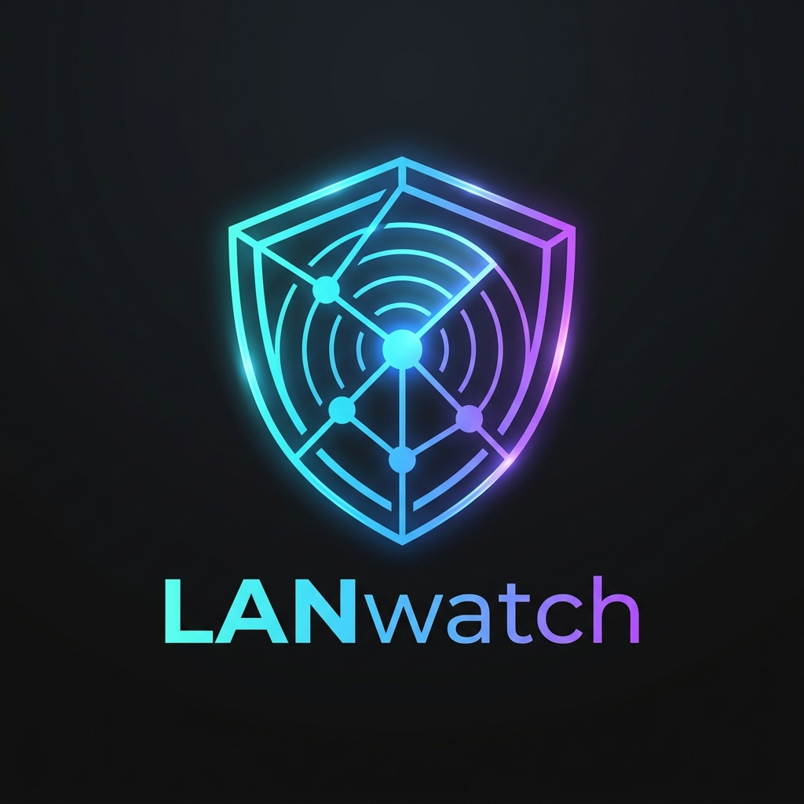
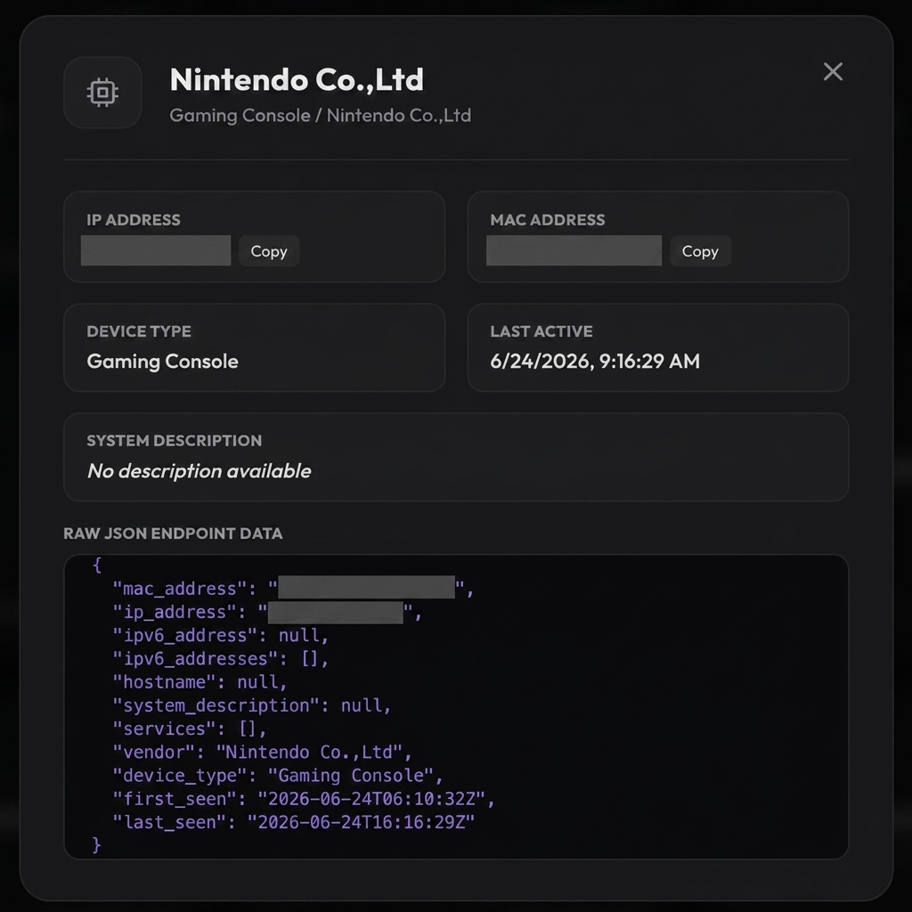

# LANwatch

[](https://github.com/rvido/lanwatch/actions/workflows/ci.yml)
[](#license)
[](https://github.com/rvido/lanwatch/stargazers)
[](https://codecov.io/github/rvido/LANwatch)



A Rust library and CLI tool for network device discovery and tracking via DHCP, mDNS, SSDP/UPnP, LLMNR, NetBIOS (NBNS), WS-Discovery (WSD), CoAP, Matter, KNXnet/IP, MQTT, Plex GDM, IP Camera discovery (SADP, Dahua, RTSP), link-layer frames (ARP, NDP, LLDP, CDP), and IEEE OUI vendor identification.


## Features

- **DHCPv4 Support**: Capture and parse DHCP DISCOVER, OFFER, REQUEST, ACK, NAK, RELEASE, and INFORM messages
- **DHCPv6 Support**: Capture and parse SOLICIT, ADVERTISE, REQUEST, CONFIRM, RENEW, REBIND, REPLY, RELEASE, DECLINE, RECONFIGURE, and INFO-REQUEST messages
- **mDNS Support** (optional): Passive and active mDNS discovery for enhanced device identification
- **SSDP/UPnP Support** (optional): Passive and active SSDP discovery for UPnP and media devices
- **ARP Sniffing**: Passive Layer 2 sniffing of ARP frames (Request & Reply) to dynamically discover silent network devices
- **DHCP Option 55, 60, & 43 OS/Vendor Fingerprinting**: Identifies device operating systems and brands using PRL (Parameter Request List), Vendor Class Identifiers, and Option 43 Vendor-Specific Information (e.g., Windows, macOS/iOS, Android/Linux, HP printers, Sonos, Ubiquiti/UniFi, Cisco, Yealink, Polycom, etc.)
- **LLMNR Sniffing** (optional): Passive sniffing of Link-Local Multicast Name Resolution (LLMNR) traffic to resolve and update local device hostnames
- **NetBIOS Name Service (NBNS) Sniffing** (optional): Passive sniffing of NetBIOS traffic on UDP port 137 to resolve hostnames and infer device roles (e.g., file server). Gated under `mdns` feature.
- **WS-Discovery (WSD) Sniffing** (optional): Passive sniffing of SOAP XML multicast probe traffic on UDP port 3702 to discover network hardware, PCs, and IP Cameras. Gated under `ssdp` feature.
- **mDNS TXT Record Parsing**: Extracts model, md, and ty metadata from DNS-SD records to identify specific hardware devices (Apple TV, Chromecast, Sonos speakers, and printer models)
- **Device Classification**: Expanded classification engine mapping hostnames, mDNS TXT metadata, and service fingerprints to specific device types and vendors (Roku, Sonos, Apple TV, Google Chromecast, ESP32 IoT, Raspberry Pi, Synology NAS, Playstation, Xbox, Nintendo, smart plugs, printers, etc.)
- **Manual Classification Overrides**: Pin a device's type (and optionally vendor) by MAC address via `--override` or an overrides file, for devices with no reliable passive signature. Overrides always win over heuristics and persist across live updates.
- **Smart Home & IoT Discovery**: Extracts model and vendor metadata from HomeKit (HAP) and Matter service advertisements (Google, Apple, Amazon, Eve, Signify/Philips Hue, Aqara, IKEA, Nanoleaf, Tuya, Somfy, TP-Link, Lutron, Yale, Belkin, Bosch, etc.)
- **Specialized IoT & Constrained Protocols**: Captures and parses CoAP (Constrained Application Protocol) on UDP port 5683, KNXnet/IP building automation traffic on UDP port 3671, and MQTT/MQTT-SN on TCP/UDP port 1883 to dynamically identify sensors, smart lights, smart plugs, and home automation systems
- **Media Server & Player Discovery**: Parses Plex GDM (Good Day Mate) XML/HTTP-like discovery broadcasts on UDP ports 32410, 32412, and 32414 to locate and identify Plex Media Servers and Players
- **IP Camera & CCTV Discovery (Physical Security)**: Identifies physical security hardware by parsing Hikvision SADP (port 9999) XML discovery messages, Dahua discovery (port 37810) JSON payloads, and RTSP (TCP port 554) server responses
- **IEEE OUI Database**: Built-in vendor identification from MAC addresses using IEEE OUI (Organizationally Unique Identifier) prefixes (40,000+ entries)
- **Device Tracking & Persistence**: Automatically track detected devices and persist them to a high-performance embedded SQLite database (`devices.db`) with index-sorted queries and Write-Ahead Logging (WAL) for lock-free, concurrent reads and writes.
- **HTTP API** (optional): Opt-in REST API server to query devices as JSON. (Requires the `http-api` feature.)
- **Library API**: Use as a library in your own Rust projects
- **CLI Tool**: Run as a standalone command-line tool
- **Type-Safe**: Strongly typed enums for message types, operations, and options
- **Cross-Platform**: Works on macOS, Linux, and other Unix-like systems

## Installation

Add to your `Cargo.toml`. The `http-api` feature is opt-in to keep binary size small by default, while `mdns` and `ssdp` provide additional active and passive discovery:

```toml
[dependencies]
# Smallest binary footprint, core DHCP & MAC tracking only
lanwatch = "0.14"

# With HTTP API server and active discovery protocols
lanwatch = { version = "0.14", features = ["http-api", "mdns", "ssdp"] }
```

Or clone and build from source. Release builds are automatically optimized for size (`opt-level = "z"`, `strip = true`, `panic = "abort"`):

```bash
git clone <repository-url>
cd lanwatch

# Smallest possible build
cargo build --release

# Enable everything
cargo build --release --all-features
```

## Usage

### Command Line

```bash
# List available interfaces
sudo cargo run

# Sniff DHCP traffic on a specific interface (saves to devices.db by default)
sudo cargo run -- en0        # macOS
sudo cargo run -- eth0       # Linux

# Specify a custom output database file
sudo cargo run -- en0 -o /path/to/devices.db
sudo cargo run -- en0 --output devices.db

# Load additional OUI database entries
sudo cargo run -- en0 --oui /path/to/oui.txt
sudo cargo run -- en0 -u ieee-oui.txt

# Start with HTTP API server (requires the http-api feature)
sudo cargo run --features http-api -- en0 --api 0.0.0.0:8080

# Start with API on default address (127.0.0.1:8080)
sudo cargo run --features http-api -- en0 --api-default

# Enable mDNS sniffing for enhanced device discovery (requires mdns feature)
sudo cargo run --features mdns -- en0 --mdns

# Enable SSDP/UPnP sniffing for enhanced device discovery (requires ssdp feature)
sudo cargo run --features ssdp -- en0 --ssdp

# Enable mDNS with active querying (sends discovery probes)
sudo cargo run --features mdns -- en0 --mdns-query

# Enable SSDP with active M-SEARCH discovery probes
sudo cargo run --features ssdp -- en0 --ssdp-query

# Pin a specific device's type when it can't be auto-detected (repeatable)
sudo cargo run -- en0 --override 'c0:84:7d:11:22:33=Security System'

# Load per-device classification overrides from a file
sudo cargo run -- en0 --overrides overrides.txt

# Combine all options
sudo cargo run --all-features -- en0 -o devices.db --api 0.0.0.0:8080 --mdns-query --ssdp-query -u oui.txt

# Show help
cargo run -- --help
```

**Note:** Root/sudo privileges are typically required for packet capture.

### Database Schema

The tool saves detected devices to an embedded **SQLite** database file. The schema contains the following fields:

- **first_seen**: ISO 8601 timestamp of first detection
- **last_seen**: ISO 8601 timestamp of last DHCP/mDNS/LLDP activity
- **mac_address**: Device MAC address (for DHCPv6, extracted from DUID-LL/LLT when available; otherwise stored as `duid:...`)
- **ip_address**: IPv4 address (requested or assigned)
- **ipv6_address**: Primary IPv6 address selected based on preference (Global Unicast (GUA) > Unique Local (ULA) > Link-Local (LLA))
- **ipv6_addresses**: Semicolon-separated list of all detected IPv6 addresses for this device
- **hostname**: Device hostname if available (empty if not)
- **device_type**: Device type inferred from discovery info (e.g., "Chromecast", "Apple TV", "Router", "Switch")
- **vendor**: Detected vendor based on OUI registry, hostnames, or hardware descriptors
- **services**: Semicolon-separated list of mDNS services (requires `mdns` feature)
- **system_description**: Detailed hardware or system description parsed from link-layer protocols (e.g., LLDP system descriptions or CDP software versions)

Database writes are executed in transactions using single-row transactional upserts, eliminating write-amplification and improving write efficiency to O(1) performance. Reads are concurrent and lock-free thanks to WAL mode.

### mDNS Service Identification

When mDNS sniffing is enabled, the tool can identify devices based on the services they advertise.
You can provide a custom services file to enhance identification:

The mDNS parser is defensive against malformed packets, including cyclic compression pointers and oversized DNS header counts.

```bash
# Use a custom services file
sudo cargo run --features mdns -- en0 --mdns -s mdns-services.txt
```

**Services file format:**
```
# Comment lines start with #
_service._tcp.local    # Description of the service
_http._tcp.local       # Web Server
_airplay._tcp.local    # AirPlay, Apple
_googlecast._tcp.local # Google Chromecast streaming protocol, Google
```

The tool includes built-in detection for:
- **Vendors**: Apple, Google, Amazon, Spotify, NVIDIA, Microsoft, Sony, Samsung, etc.
- **Device Types**: Chromecast, Apple TV, Fire TV, AirPlay Device, Printer, Scanner, NAS, Smart Home Device, Android TV, NVIDIA Shield, etc.

Loading a services file allows for more comprehensive identification. Device types are inferred from
service descriptions (e.g., "_googlecast._tcp" → "Chromecast").

### IEEE OUI Database

To prevent the binary from growing bloated and containing stale database listings, LANwatch does not bundle the IEEE OUI database. Instead, you can download the latest official IEEE registry dynamically and load it at runtime.

**How to download and use the latest OUI registry:**

1. Download the latest official OUI database file:
   ```bash
   sudo cargo run -- --download-oui
   # This downloads the official list from standards-oui.ieee.org and saves it to `ieee-oui.txt`
   ```

   The download shells out to `curl` and accepts `https://` URLs only, with
   `--proto =https` so a redirect cannot downgrade the transport. Library
   callers passing a custom URL to `download_ieee_oui` are held to the same
   rule.

2. Run LANwatch loading the downloaded OUI database:
   ```bash
   sudo cargo run -- en0 --oui ieee-oui.txt
   ```

**Default OUI location:**
At startup, LANwatch automatically looks for `ieee-oui.txt` (the file `--download-oui` produces) in the current working directory, falling back to `oui.txt` if that isn't found. If either is found, it will load it automatically.

You can load any custom OUI file using the `--oui` parameter:
```bash
# Load a custom OUI mapping file
sudo cargo run -- en0 --oui custom-oui.txt
```

**Supported OUI file formats:**

Both the `--oui`/`-u` flag and the default auto-load path auto-detect which format below a file is in, so either can be pointed at an IEEE registry download or a hand-written override list interchangeably.

```
# IEEE OUI format (from IEEE registry downloads)
00-1A-2B   (hex)    Vendor Name, Inc.

# Simple colon format
00:1A:2B    Vendor Name

# Simple dash format  
00-1A-2B    Vendor Name

# Compact format (no separators)
001A2B Vendor Name

# Comments start with #
# This is a comment line
```

The IEEE maintains the official OUI registry at:
https://standards-oui.ieee.org/oui/oui.txt

**Vendor priority:** mDNS-detected vendors take precedence over OUI lookups, as mDNS provides
more specific identification (e.g., "Google Chromecast" vs just "Google" from OUI).

### Device Classification Overrides

Some devices expose no reliable passive signature — no mDNS/SSDP services, an opaque hostname, and
a MAC OUI belonging to a generic module maker rather than the product vendor. For example, a
SimpliSafe video doorbell built on an AMPAK Wi-Fi module (OUI `c0:84:7d`) reports the vendor "AMPAK
Technology, Inc." and, because its DHCP fingerprint requests option 249, is auto-classified as
"PC/Windows". There is no safe automatic rule for such devices, so LANwatch lets you pin the
classification manually by MAC address.

A manual override always wins over heuristic classification. It is applied to existing database
entries at startup and re-enforced during live capture, so subsequent DHCP renewals (or any other
heuristic) cannot revert it.

**Inline override (`--override`, repeatable):**

```bash
# Format: MAC=DeviceType
sudo cargo run -- en0 --override 'c0:84:7d:11:22:33=Security System'

# Pin several devices at once
sudo cargo run -- en0 \
  --override 'c0:84:7d:11:22:33=Security System' \
  --override 'aa:bb:cc:dd:ee:ff=Printer'
```

**Override file (`--overrides`):**

```bash
sudo cargo run -- en0 --overrides overrides.txt
```

**Override file format:**

```
# Comment lines start with #
# Format: MAC,DeviceType[,Vendor]   (Vendor is optional)
c0:84:7d:11:22:33, Security System, SimpliSafe
aa:bb:cc:dd:ee:ff, Printer
```

The MAC address is matched case-insensitively and accepts common separators. The device type should
be a canonical type name (e.g. `Security System`, `Smart Doorbell`, `Security Camera`, `Printer`); an
unrecognized name is preserved verbatim as a custom label. The optional third field pins the vendor.

### HTTP API

> **Note:** The HTTP API requires the `http-api` feature, which is enabled by default.
> Build with `--no-default-features` to disable it.

When started with `--api` or `--api-default`, the tool exposes a REST API for querying devices:

**Endpoints:**

| Endpoint | Method | Description |
|----------|--------|-------------|
| `/` | GET | Serves the interactive Web Dashboard |
| `/devices` | GET | List all devices as JSON (sorted by last_seen) |
| `/devices/{mac}` | GET | Get a specific device by MAC address |
| `/devices/count` | GET | Get device count |
| `/devices/{mac}` | DELETE | Remove a single device by MAC address |
| `/devices` | DELETE | Remove all tracked devices (flush) |
| `/health` | GET | Health check endpoint |

> **Note:** Removal only clears current state (in-memory and the database row). Discovery
> is passive and keyed solely by MAC address, so a device still active on the LAN will simply
> reappear as a new entry the next time it's observed (DHCP renewal, ARP, mDNS, etc.).

**Example Requests:**

```bash
# Get all devices
curl http://localhost:3000/devices

# Get device count
curl http://localhost:3000/devices/count

# Get a specific device
curl http://localhost:3000/devices/AA:BB:CC:DD:EE:FF

# Health check
curl http://localhost:3000/health

# Remove a single device
curl -X DELETE http://localhost:3000/devices/AA:BB:CC:DD:EE:FF

# Remove all devices
curl -X DELETE http://localhost:3000/devices
```

**Example Response (`/devices`):**

```json
{
  "success": true,
  "count": 1,
  "data": [
    {
      "mac_address": "AA:BB:CC:DD:EE:FF",
      "ip_address": "192.168.1.100",
      "ipv6_address": "fe80::1",
      "ipv6_addresses": ["fe80::1", "2001:db8::1"],
      "hostname": "mydevice",
      "services": ["_http._tcp", "_airplay._tcp"],
      "vendor": "Apple",
      "device_type": "AirPlay Device",
      "first_seen": "2026-01-16T10:25:00Z",
      "last_seen": "2026-01-16T10:30:45Z"
    }
  ]
}
```

### Web Dashboard

LANwatch features a premium web-based dashboard accessible directly at `http://localhost:8080/` (or the custom address configured via the `--api` flag) when running the sniffer. The dashboard dynamically updates as devices are discovered, offering search filtering, category tabs, and detailed inspection views.

**Key UI Features:**
- **Simultaneous IPv4 & IPv6 Tracking**: Displays both IPv4 and multiple IPv6 addresses (link-local, local, global unicast) for each device tile, including a themed badge for additional detected IPv6 addresses.
- **Scope-based IP Classification**: In the inspection drawer, addresses are clearly organized and labeled by scope (`IPv4`, `IPv6 Link-Local`, `IPv6 Unique Local`, `IPv6 Global`).
- **Secure Context Clipboard Fallback**: Integrated copy-to-clipboard buttons for all IP and MAC addresses that work seamlessly in both secure contexts (HTTPS/localhost) and insecure contexts (HTTP/remote IP) with visual green success animations.
- **Remove / Flush Devices**: Each device tile and the inspection drawer offer a "Remove Device" action, and a toolbar "Flush All" button clears the entire tracked list — both gated behind a confirmation prompt.



### Library Usage

```rust
use lanwatch::{DhcpSniffer, DhcpEvent, DeviceTracker, Dhcpv6Option};

fn main() {
    let mut sniffer = DhcpSniffer::new("en0").expect("Failed to create sniffer");
    let mut tracker = DeviceTracker::new("devices.db").expect("Failed to create tracker");

    sniffer.run(|event| {
        match &event {
            DhcpEvent::V4(packet) => {
                let is_new = tracker.update_from_dhcpv4(packet);
                println!("DHCPv4: {} -> {}", packet.source_ip, packet.dest_ip);
                println!("  Type: {:?}", packet.message_type);
                println!("  Client MAC: {}", packet.client_mac_string());
                if is_new {
                    println!("  [New or updated device]");
                }
            }
            DhcpEvent::V6(packet) => {
                let is_new = tracker.update_from_dhcpv6(packet);
                println!("DHCPv6: {} -> {}", packet.source_ip, packet.dest_ip);
                println!("  Type: {}", packet.message_type);
            }
        }
        true // Continue sniffing
    });
}
```

### Parsing Raw Payloads

```rust
use lanwatch::{parse_dhcpv4_payload, parse_dhcpv6_payload};
use std::net::{Ipv4Addr, Ipv6Addr};

// Parse a DHCPv4 payload
if let Some(packet) = parse_dhcpv4_payload(
    &payload_bytes,
    Ipv4Addr::new(0, 0, 0, 0),
    Ipv4Addr::new(255, 255, 255, 255),
    68, 67,
) {
    println!("Message type: {:?}", packet.message_type);
}

// Parse a DHCPv6 payload
if let Some(packet) = parse_dhcpv6_payload(
    &payload_bytes,
    Ipv6Addr::new(0xfe80, 0, 0, 0, 0, 0, 0, 1),
    Ipv6Addr::new(0xff02, 0, 0, 0, 0, 0, 1, 2),
    546, 547,
) {
    println!("Message type: {}", packet.message_type);
    println!("Transaction ID: {}", packet.transaction_id_string());
    println!("Options: {:?}", packet.options);
}
```

## Examples

Run the included examples:

```bash
# Basic sniffer with packet counter
sudo cargo run --example basic_sniffer en0

# Parse sample payloads (no root required)
cargo run --example parse_payload
```

## API Reference

### Main Types

- `DhcpSniffer` - Main sniffer struct for capturing DHCP packets
- `NetworkSniffer` - Extended sniffer for DHCP + mDNS/SSDP (requires `mdns` and/or `ssdp` feature)
- `DhcpEvent` - Enum containing either `V4(Dhcpv4Packet)` or `V6(Dhcpv6Packet)`
- `NetworkEvent` - Enum for DHCP, mDNS, or SSDP events (requires `mdns` and/or `ssdp` feature)
- `Dhcpv4Packet` - Parsed DHCPv4 packet with all fields
- `Dhcpv6Packet` - Parsed DHCPv6 packet with all fields
- `MdnsPacket` - Parsed mDNS packet (requires `mdns` feature)
- `MdnsRecord` - DNS resource record from mDNS
- `MdnsQuerier` - Active mDNS query sender (requires `mdns` feature)
- `SsdpPacket` - Parsed SSDP packet (requires `ssdp` feature)
- `SsdpQuerier` - Active SSDP M-SEARCH sender (requires `ssdp` feature)
- `DeviceTracker` - Track detected devices and persist to an embedded SQLite database
- `DeviceInfo` - Information about a detected device
- `OuiRegistry` - IEEE OUI database for MAC-to-vendor lookups
- `DhcpError` - Error types for sniffer operations
- `ApiServer` - HTTP API server for querying devices

### Message Types

**DHCPv4:**
- `Dhcpv4MessageType`: Discover, Offer, Request, Decline, Ack, Nak, Release, Inform
- `Dhcpv4Operation`: BootRequest, BootReply

**DHCPv6:**
- `Dhcpv6MessageType`: Solicit, Advertise, Request, Confirm, Renew, Rebind, Reply, Release, Decline, Reconfigure, InfoRequest
- `Dhcpv6Option`: ClientId, ServerId, IaNa, ClientFqdn, Other

### Constants

- `DHCPV4_SERVER_PORT` (67)
- `DHCPV4_CLIENT_PORT` (68)
- `DHCPV6_CLIENT_PORT` (546)
- `DHCPV6_SERVER_PORT` (547)
- `MDNS_PORT` (5353) - requires `mdns` feature
- `MDNS_IPV4_MULTICAST` (224.0.0.251) - requires `mdns` feature
- `MDNS_IPV6_MULTICAST` (ff02::fb) - requires `mdns` feature
- `SSDP_PORT` (1900) - requires `ssdp` feature
- `SSDP_IPV4_MULTICAST` (239.255.255.250) - requires `ssdp` feature
- `SSDP_IPV6_MULTICAST` (ff02::c) - requires `ssdp` feature

### Helper Functions

- `list_interfaces()` - List available network interfaces
- `find_interface(name)` - Find interface by name
- `is_dhcpv4_ports(src, dest)` - Check if ports indicate DHCPv4
- `is_dhcpv6_ports(src, dest)` - Check if ports indicate DHCPv6
- `is_mdns_ports(src, dest)` - Check if ports indicate mDNS (requires `mdns` feature)
- `is_ssdp_ports(src, dest)` - Check if ports indicate SSDP (requires `ssdp` feature)
- `parse_dhcpv4_payload(payload, src, dst, src_port, dst_port)` - Parse DHCPv4 from raw bytes
- `parse_dhcpv6_payload(payload, src, dst, src_port, dst_port)` - Parse DHCPv6 from raw bytes
- `parse_mdns_payload(payload, source_mac, src, dst)` - Parse mDNS from raw bytes (requires `mdns` feature)
- `parse_ssdp_payload(payload, source_mac, src, dst)` - Parse SSDP from raw bytes (requires `ssdp` feature)
- `display_safe(value)` - Wrap untrusted text so printing it cannot emit terminal escapes or display-spoofing codepoints (borrows, no allocation)
- `build_mdns_query(name, record_type)` - Build an mDNS query packet (requires `mdns` feature)
- `build_ssdp_search_request(search_target)` - Build an SSDP M-SEARCH request (requires `ssdp` feature)
- `start_api_server(addr, tracker)` - Start HTTP API server in background thread (requires `http-api` feature)
- `to_json()` / `to_json_sorted()` - Export devices as JSON (requires `http-api` feature)

## Feature Flags

| Feature | Default | Description |
|---|---|---|
| `http-api` | ✗ | Enables the HTTP REST API server, JSON export, and Web Dashboard |
| `mdns` | ✗ | Enables mDNS (Multicast DNS) sniffing for enhanced device discovery |
| `ssdp` | ✗ | Enables SSDP/UPnP sniffing and active M-SEARCH discovery |

```bash
# Build with minimal default features
cargo build --release

# Build with HTTP API server & web dashboard
cargo build --release --features http-api

# Build with mDNS support
cargo build --release --features mdns

# Build with SSDP support
cargo build --release --features ssdp

# Build with all features
cargo build --release --all-features
```

## Network Discovery Flow (Passive vs Active)


### mDNS Discovery

When the `mdns` feature is enabled, the tool can capture mDNS traffic to discover:

- Device hostnames (`.local` names)
- Service types (HTTP, AirPlay, Chromecast, printers, etc.)
- IP address to hostname mappings

**Passive mode** (`--mdns`): Captures mDNS announcements as devices broadcast them.

**Active mode** (`--mdns-query`): Also sends multicast queries for common services. To prevent multicast leakage over WAN ports on multi-homed hosts and routers, LANwatch queries the local IPv4 address of the specified network interface and binds the outgoing query sockets directly to it. Common queried services include:
- `_http._tcp.local` - Web servers
- `_airplay._tcp.local` - Apple AirPlay devices
- `_googlecast._tcp.local` - Chromecast devices
- `_printer._tcp.local` - Network printers
- `_smb._tcp.local` - SMB file shares
- And more...

### SSDP/UPnP Discovery

When the `ssdp` feature is enabled, the tool can capture SSDP (Simple Service Discovery Protocol) traffic to discover UPnP devices:

- Media servers and renderers (DLNA/UPnP)
- Network routers and gateways
- Smart home devices and IoT equipment
- Printers and scanning devices
- Vendor fingerprinting via SSDP headers

**Passive mode** (`--ssdp` or `--upnp`): Listens for SSDP announcements (NOTIFY messages and responses).

**Active mode** (`--ssdp-query`): Also sends M-SEARCH discovery probes. Similar to active mDNS, the outgoing socket binds directly to the local interface IPv4 address to prevent queries from leaking onto the WAN interface:
- `ssdp:all` - All SSDP devices
- `upnp:rootdevice` - All UPnP root devices
- MediaServer and MediaRenderer devices
- Internet Gateway Devices (routers)
- Printer and DIAL-enabled devices (Chromecast, etc.)

The tool extracts vendor information and device types from SSDP server headers and service descriptors.

### ARP Sniffing (Layer 2 Passive Discovery)

When raw network sniffing is enabled (via the `mdns` or `ssdp` features), LANwatch automatically captures Layer 2 ARP frames (both Request and Reply operations). This allows LANwatch to discover silent devices on the local network link that do not transmit DHCP, mDNS, or SSDP/UPnP traffic, expanding discovery coverage significantly.

### DHCP Option 55, 60 & 43 OS/Vendor Fingerprinting


When parsing DHCPv4 payloads, LANwatch extracts:
- **Option 55 (Parameter Request List)**: Matches common signature sequences (such as Option 249 for Microsoft Windows, Option 95 for Apple, and Options 26 & 28 for Android/Linux) to identify the operating system.
- **Option 60 (Vendor Class Identifier)**: Matches vendor class identifier strings to classify device brands and operating systems (e.g., `MSFT` -> Microsoft PC/Windows, `Android` -> Google Android Phone, `Hewlett-Packard JetDirect` -> HP Printer, `Roku` -> Roku Media Player, `Sonos` -> Sonos Smart Speaker, `Apple TV` -> Apple TV).
- **Option 43 (Vendor-Specific Info)**: Extracts printable ASCII sequences from Option 43 sub-options to identify enterprise and VoIP hardware (e.g., `UniFi` -> Ubiquiti Network Device, `Yealink`/`Polycom`/`Mitel`/`Avaya` -> IP Phone, `Cisco`).

### LLMNR Sniffing (Link-Local Multicast Name Resolution)

Under the `mdns` feature gate, LANwatch listens passively to UDP port 5355 LLMNR packets. LLMNR requests and responses (which share standard RFC 1035 DNS structure) are sniffed and parsed to automatically associate IP addresses with local device hostnames without needing active reverse DNS queries.

### NetBIOS Name Service (NBNS) Sniffing

Under the `mdns` feature gate, LANwatch passively sniffs NetBIOS Name Service (NBNS) packets on UDP port 137. It decodes the two-character nibble-encoded NetBIOS names to resolve local network hostnames, and checks name suffix roles (e.g. `0x20` indicating the File Sharing service) to identify and classify roles like "File Server".

### WS-Discovery (WSD) Sniffing

Under the `ssdp` feature gate, LANwatch passively listens to UDP port 3702 WS-Discovery SOAP XML probe and announcement traffic. By parsing elements such as `<wsd:Types>` (e.g., `NetworkVideoTransmitter` for IP Cameras) and publisher `<pub:ModelName>` metadata, WSD sniffing dynamically identifies smart hardware, printers, and surveillance equipment.

### mDNS TXT Record Parsing

When processing mDNS traffic under the `mdns` feature gate, LANwatch extracts key-value parameters from TXT records (such as `model`, `md`, or `ty`). These hardware and model descriptors (e.g., `AppleTV14,1`, `Sonos Play:1`, or printer models) are cross-referenced to determine exact manufacturer and device classifications.

### Smart Home & IoT Discovery (Matter & HomeKit)

Under the `mdns` feature gate, LANwatch monitors mDNS announcements to extract metadata from HomeKit Accessory Protocol (`_hap._tcp`) and Matter (`_matter._tcp`) service instances. It decodes Manufacturer, Model, Category Identifier (determining device type like Outlet, Smart Light, Sensor, Bridge), and Pairing status.

### Constrained & Building Automation Protocols (CoAP & KNXnet/IP)

Under the `ssdp` feature gate, LANwatch passively sniffs UDP port 5683 to parse CoAP (Constrained Application Protocol) payloads (e.g., CoRE Link Format) and UDP port 3671 to parse KNXnet/IP building automation traffic, dynamically categorizing sensors, smart bulbs, switches, and home automation systems.

### IP Camera & CCTV Discovery (Physical Security)

Under the `ssdp` feature gate, LANwatch sniffs physical security endpoints via:
- **Hikvision SADP**: Sniffing UDP ports 9999 and 37020 for SOAP XML probe/response frames, extracting exact model names and serial numbers.
- **Dahua Discovery**: Sniffing UDP port 37810 JSON-over-UDP frames, parsing camera models and serial numbers.
- **RTSP Traffic**: Sniffing TCP port 554 to identify generic surveillance and media streaming cameras. Only traffic *originating* from port 554 with an RTSP-shaped payload is counted, so a client connecting to a camera is not itself recorded as one.

A device is always keyed on the MAC observed in the Ethernet header. SADP and Dahua payloads may also *claim* a MAC; that value is surfaced separately as `CctvPacket::claimed_mac` and never used as an identity, since any host on the segment can assert an arbitrary one.

### MQTT & MQTT-SN Sniffing

Under the `ssdp` feature gate, LANwatch passively sniffs MQTT (TCP port 1883) and MQTT-SN (UDP port 1883) `CONNECT` frames to discover IoT client devices, extracting their unique Client Identifier and protocol level.

### Plex GDM (Good Day Mate) Protocol

Under the `ssdp` feature gate, LANwatch sniffs Plex GDM discovery messages broadcast over UDP ports 32410, 32412, and 32414. By parsing the HTTP-like text payload, it extracts device friendly name, product (e.g. Plex Media Server, Plex for Apple TV), unique resource identifier UUID, and the service port.

#### Summary of IoT & Camera Discovery Protocols

| Protocol | Port / Protocol | Target Devices | Data Extracted |
|---|---|---|---|
| **CoAP** | UDP 5683 | Thread, Zigbee IP, low-power IoT | Device endpoints and resource directories |
| **Matter** | UDP 5353 (mDNS) | Modern Smart Plugs, Bulbs, Hubs | Vendor ID (VID) & Product ID (PID) |
| **KNXnet/IP** | UDP 3671 | Smart Building / HVAC Controls | Smart switches, actuator controls |
| **SADP** | UDP 37020 / 9999 | Hikvision CCTV & IP Cameras | Model number, serial number, firmware version |
| **Dahua** | UDP 37810 | Dahua CCTV & IP Cameras | Camera model, software version |
| **MQTT** | TCP/UDP 1883 | IoT Devices, Smart Appliances | Client ID, protocol flavor (MQTT / MQTT-SN) |
| **Plex GDM** | UDP 32410-32414 | Plex Media Servers & Players | Friendly name, product type, resource UUID, service port |

## Development and Build Automation

A `Makefile` is provided to simplify common development, testing, linting, and documentation tasks.

### Available Makefile Targets:

*   **Build with all features:**
    ```bash
    make build
    ```
*   **Build with minimal default features:**
    ```bash
    make build-minimal
    ```
*   **Build in optimized release mode with all features:**
    ```bash
    make release
    ```
*   **Cross-compile release binary for ARM64 (aarch64-unknown-linux-gnu):**
    ```bash
    make release-aarch64
    ```
*   **Run all unit tests:**
    ```bash
    make test
    ```
*   **Generate crate documentation (enforcing 100% doc coverage):**
    ```bash
    make doc
    ```
*   **Lint the codebase with Clippy (warnings treated as errors):**
    ```bash
    make clippy
    ```
*   **Format the codebase:**
    ```bash
    make fmt
    ```
*   **Verify code formatting:**
    ```bash
    make fmt-check
    ```
*   **Quickly typecheck code:**
    ```bash
    make check
    ```
*   **Build all example binaries with all features enabled:**
    ```bash
    make examples
    ```
*   **List all available make targets:**
    ```bash
    make help
    ```

## Handling Untrusted Traffic

Everything LANwatch parses arrives unauthenticated from the local segment, and
any host on that segment can send whatever it likes. The parsers are written to
treat all of it as hostile input: malformed or truncated frames yield `None`
rather than panicking or over-allocating, and the limits below bound what a
single sender can cost you.

### Parsing limits

| Limit | Value | Why |
|---|---|---|
| DNS compression-pointer jumps per name | 64 | A pointer chain through fresh offsets would otherwise make name decoding quadratic, and it is paid again for every record in the packet |
| Decoded DNS name length | 255 bytes | RFC 1035 §2.3.4 |
| SSDP payload parsed | 8 KiB | A 64 KiB datagram of one-character headers is thousands of allocations at line rate |
| SSDP headers retained | 64, 512 bytes each | Same |
| Services stored per device | 64, 128 bytes each | The list is re-serialized into one SQLite cell on every flush, so unbounded growth costs write amplification as well as memory |
| CCTV model / serial fields | 255 bytes | These land in the database verbatim |
| Consecutive capture errors before giving up | 100 | A removed interface would otherwise spin forever on stderr |

Traffic beyond a limit is dropped, not truncated: a value that long is
malformed rather than merely verbose, and silently trimming it would invent a
plausible-looking model or hostname no device ever reported.

### Identity is never self-reported

A device is keyed on the MAC address observed in the Ethernet header. Where a
protocol lets a payload assert its own MAC — Hikvision SADP `<MAC>`, Dahua
`"mac"` — that value is recorded separately and never becomes an identity.
Otherwise a single crafted datagram could create or overwrite any entry in the
inventory, including a real device's.

DHCPv4 frames are validated against the RFC 2131 magic cookie and an Ethernet
`htype`/`hlen` before `chaddr` is read as a MAC, so an unrelated datagram that
happens to use port 67/68 cannot contribute six arbitrary bytes as a device.

### Text harvested from the network

Device names, models, and descriptions are attacker-controlled strings that end
up on your terminal, in the database, in JSON responses, and in the dashboard.
They are neutralized in two places, depending on what the value is for:

- **Free text** (LLDP/CDP TLVs, CCTV model and serial, MQTT client ID, Plex GDM
  and KNX names, CoAP payloads) is sanitized in the parsers, as it comes off
  the wire. Control characters, ANSI escapes, bidirectional overrides, and
  zero-width characters are stripped, and the result is capped at 255
  characters. Everything downstream receives already-clean text.
- **Protocol identifiers** (DNS record names, NetBIOS names, SSDP header
  values) must keep their exact bytes to drive service matching and vendor
  fingerprinting, so they are stored as received and passed through
  `display_safe()` at the point they are printed.

The dashboard additionally HTML-escapes every value it renders, and the CLI
prints TXT record contents with Rust's `Debug` formatting, which escapes
control characters on its own.

### Backpressure

The capture thread never blocks on the database worker. If the worker falls
behind, events are dropped and counted rather than stalling capture — blocking
would overflow the kernel's ring buffer and lose the same packets invisibly.
A warning is printed every 1000 dropped events, and a final tally on exit:

```
Warning: worker cannot keep up; 1000 event(s) dropped so far
```

Seeing this means your capture has gaps. It usually indicates the database is
on slow storage, or the interface is carrying more discovery traffic than one
worker can classify.

### Scope

These measures bound resource use and prevent one host from corrupting another
host's record. They are not an authentication boundary. In particular the HTTP
API has no authentication: it binds `127.0.0.1:8080` by default, and `DELETE
/devices` will wipe the database for anyone who can reach it. If you bind it to
a routable address, put your own access control in front of it.

## Performance Tuning & Optimizations

LANwatch includes several configurations and design patterns to maximize execution speed and scalability on hotpaths under high network traffic:

*   **Host-Specific CPU Optimizations (`target-cpu=native`)**: Configured globally in `.cargo/config.toml` to compile LANwatch utilizing all instruction set extensions (AVX2, SSE4.2, NEON, etc.) supported by your local CPU, allowing LLVM to perform advanced loop vectorization and unrolling.
*   **O(1) Transactional Database Updates**: Migrated the storage backend from full-file serializations to SQLite with Write-Ahead Logging (WAL), reducing write amplification from O(N) full file rewrites to O(1) single-row updates.
*   **O(log N) Indexed Sorting**: Refactored the REST API query engine to run paginated, pre-sorted index scans inside SQLite directly rather than cloning and sorting the entire registry in-memory, cutting memory overhead to O(page_size) and sorting to O(log N).
*   **Zero-Allocation Hostname Classification**: Device classification in the parser loops avoids heap allocations for case conversion. Service de-duplication compares against the normalized form without building it, so the common "already advertised" case allocates nothing.
*   **Integer-Keyed OUI Registry**: An OUI is three bytes, so the vendor table is keyed on the prefix packed into a `u32` rather than an `"AA:BB:CC"` string — removing roughly 35,000 key allocations when the full IEEE registry is loaded, along with a string hash and comparison on every lookup.
*   **Dynamic Allocator Swap**: For concurrent HTTP API and high-traffic packet capture, you can preload lock-free allocators (`mimalloc` or `jemalloc`) dynamically without altering code:
    ```bash
    LD_PRELOAD=/usr/lib/libmimalloc.so ./target/release/lanwatch eth0 --api
    ```
*   **Global Customization Skills**: Standard optimization and test coverage configurations can be invoked using the global skills `/home/richard/.gemini/config/skills/senior_performance_engineer/` and `/home/richard/.gemini/config/skills/rust_coverage/`.

## Dependencies

- [pnet_datalink](https://crates.io/crates/pnet_datalink) / [pnet_packet](https://crates.io/crates/pnet_packet) - Low-level networking libraries for packet capture and frame parsing
- [rusqlite](https://crates.io/crates/rusqlite) - Embedded SQLite database engine with bundled C library for device persistence
- [serde](https://crates.io/crates/serde) - Serialization framework for device data structures
- [serde_json](https://crates.io/crates/serde_json) - JSON serialization for HTTP API export (optional, `http-api` feature)
- [tiny_http](https://crates.io/crates/tiny_http) - Lightweight HTTP server for the REST API and Web Dashboard (optional, `http-api` feature)

## License

This project is dual-licensed under the MIT License and the Apache License, Version 2.0.
- See the [LICENSE-MIT](LICENSE-MIT) file for the MIT License details.
- See the [LICENSE-APACHE](LICENSE-APACHE) file for the Apache License details.

## Author

Richard Vidal-Dorsch

## Contributing

Contributions are welcome! Please feel free to submit a Pull Request.
